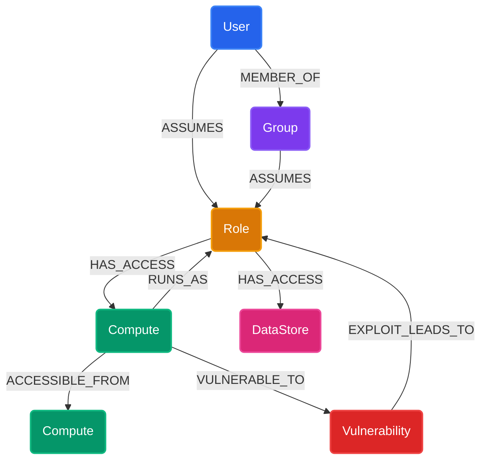
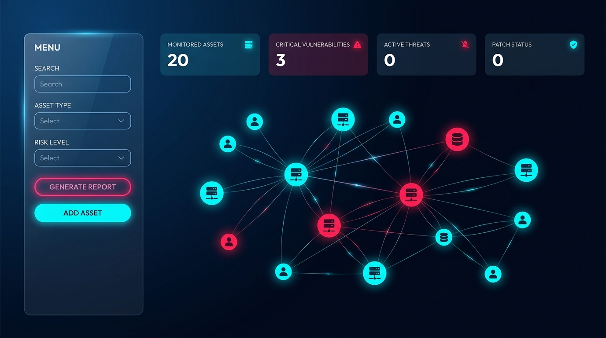

# AegisGraph: Cloud IAM & Network Attack Path Analyzer

AegisGraph is a cybersecurity tool for visualising and auditing cloud infrastructure configurations. It helps security engineers locate potential lateral movement vectors, identify privilege escalation paths, and determine the "blast radius" of compromised assets (e.g. EC2 instances or IAM User credentials). The data is powered by a graph database layer using **CognoDB**.

---

## 🔗 Live Hosted Demo

The application is deployed and available to interact with in the cloud:
👉 **[AegisGraph Live Demo](https://aegisgraph-app.onrender.com/)**

*(Note: The database is pre-seeded and fully connected to a live CognoDB Cloud instance. Reviewers can click finding cards in the **Attack Vector Audit** tab or select assets in the **Path Finder** to trace paths immediately!)*

---

## 🧭 Why a Graph Database?

A relational database (RDBMS) represents data in tables, requiring multiple foreign key joins to resolve relationships. In cloud environments, security paths consist of mixed entity types:
- A **User** belongs to a **Group**.
- A **Group** assumes an **IAM Role**.
- An **IAM Role** grants permissions to write to an **EC2 Compute** instance.
- An **EC2 Compute** instance runs an application with a critical **Vulnerability**.
- That **Vulnerability** can be exploited, granting access to another **IAM Role** that has access to a **Data Store**.

Querying this privilege chain in a relational database requires a recursive Common Table Expression (CTE) with numerous joins. As the depth of the path increases, query performance degrades exponentially and the SQL code becomes highly complex, fragile, and prone to endless loops.

**CognoDB (Graph Database) advantages:**
1. **Index-Free Adjacency**: Traversing a relationship is a constant-time \(O(1)\) pointer dereference rather than an \(O(\log N)\) join index lookup. This makes multi-hop traversals and reachability queries extremely fast.
2. **Expressive Path Queries**: The openCypher language is designed specifically for patterns. Finding arbitrary-length attack paths is reduced to a single line: `MATCH p = shortestPath((src)-[*1..15]->(dst)) RETURN p`.
3. **Flexible Schema**: Cloud resources frequently update properties. Graphs allow nodes to easily carry varying properties without requiring complex database schema migrations.

---

## 📊 Data Model Diagram

Below is the graph schema showing the asset nodes (circles/rectangles) and their security relationships:



### Node Types and Key Properties
- **User**: Represents physical identities (e.g. `name`, `role_title`, `status`).
- **Group**: Represents collections of permissions.
- **Role**: AWS IAM roles with specific privileges (e.g. `arn`).
- **Compute**: EC2 instances or servers (e.g. `ip_address`, `public`, `status`).
- **DataStore**: S3 buckets or RDS databases (e.g. `db_type`).
- **Vulnerability**: Software flaws (e.g. `cve`, `severity`, `score`, `description`).
- *Note: All assets share standard `id`, `name`, and `criticality` ("High", "Medium", "Low") properties.*

---

## 🛠️ Key Cypher Queries Explained

### 1. Attack Path Finder
This query finds the shortest path of permissions and configurations linking a starting asset and a target. It allows variable-length transitions of up to 15 hops:
```cypher
MATCH (src {id: $source_id}), (dst {id: $target_id})
MATCH p = shortestPath((src)-[:MEMBER_OF|ASSUMES|HAS_ACCESS|RUNS_AS|ACCESSIBLE_FROM|VULNERABLE_TO|EXPLOIT_LEADS_TO*1..15]->(dst))
RETURN p
```

### 2. Blast Radius Assessment
Determines what assets are reachable (and therefore compromiseable) if an attacker gains control of a starting asset. It queries all outgoing paths up to a specified depth (default 3 hops):
```cypher
MATCH (src {id: $source_id})
MATCH p = (src)-[:MEMBER_OF|ASSUMES|HAS_ACCESS|RUNS_AS|ACCESSIBLE_FROM|VULNERABLE_TO|EXPLOIT_LEADS_TO*1..3]->(dst)
RETURN p
```

### 3. Vulnerability Auditor (Attack Chains)
Identifies structural privilege escalation chains where an internet-exposed server contains a software vulnerability that grants access to a role, which in turn has access to a sensitive data store:
```cypher
MATCH (c:Compute)-[:VULNERABLE_TO]->(v:Vulnerability)-[:EXPLOIT_LEADS_TO]->(r:Role)-[:HAS_ACCESS]->(ds:DataStore)
RETURN c, v, r, ds
```

---

## 📷 User Interface Preview

Here is a preview of the interactive AegisGraph dashboard visualization, showing the asset network layout and risk parameters:



---

## 🚀 Setup & Execution Instructions

### 1. Create a CognoDB Cloud Instance
1. Sign up for a free account at [https://console.cognodb.com/signup](https://console.cognodb.com/signup).
2. Create a free (`c0`) database instance and select your region.
3. Save your generated **Connection URI** (in the form `bolt+s://<instance-id>.databases.cognodb.cloud`) and the password generated for user `cognodb`.

### 2. Configure Environment Variables
Create a file named `.env` in the project root based on the template:
```bash
cp .env.example .env
```
Fill in the configuration details:
```env
COGNODB_URI=bolt+s://<instance-id>.databases.cognodb.cloud
COGNODB_USER=cognodb
COGNODB_PASSWORD=your_saved_password
PORT=5001
```

### 3. Install Python Dependencies
Ensure you have Python 3.9+ installed, then run:
```bash
pip3 install -r requirements.txt
```

### 4. Seed the Database
Populate the database with the pre-built mock infrastructure topology by running the CLI seed command:
```bash
python3 seed.py
```
*Note: This can also be triggered directly from the "Admin" tab in the web application UI.*

### 5. Start the Web Application
Launch the Flask server:
```bash
python3 app.py
```
